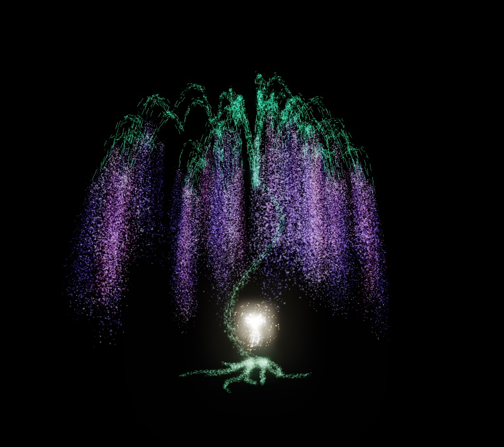

# three-of-souls

биолюминесцентное **Древо Душ** (как в Аватаре) из ~107 000 частиц, живущее
поверх картинки с вебки и **управляемое жестами рук** — без единого клика.
раскрыл кулак — из ладони зарождается семя Эйвы, взрывается прямо в руке, и из
вспышки вырастает дерево. проект делался под съёмку вертикальных роликов:
блум, слоу-мо, ударные волны — весь тайминг подогнан под «первые две секунды
решают».

<p align="center">
  
</p>

> работает целиком **в браузере, локально**: MediaPipe гоняет нейронку
> трекинга рук на WASM/GPU, three.js рисует частицы. на сервер ничего не
> уходит, нужен только статический http-сервер и интернет при первом запуске
> (CDN-модули и модель руки ~8 МБ, дальше кэш).

---

## как это работает

```
вебка → MediaPipe HandLandmarker (21 точка × 2 руки, каждый кадр)
      → gestures.js: устойчивые треки рук (сшивка по предсказанной позиции,
        адаптивное EMA, история позиций 700мс, гистерезис ладонь/кулак)
      → main.js: стейт-машина
        HIDDEN → SUMMON → GROWING → TREE ⇄ EXPANDED
                                    TREE → GRABBED → RIPPED → DEAD → RESURRECT
      → tree.js + fx.js: у каждой частицы 4 «дома» (дерево / галактика /
        рассеяние / пепел), все переходы интерполируются в GLSL на GPU
```

ключевая идея надёжности жестов: **не мгновенная скорость, а смещение по
истории позиций**. EMA-сглаживание душит скорость быстрых свайпов, поэтому
свайп детектится как «куда рука сместилась за последние 450мс» — срабатывает
с первого раза даже при смазанной картинке.

## жесты

| жест | действие |
|---|---|
| ✊→🖐 раскрыть кулак | из ладони зарождается семя → взрыв → вырастает дерево |
| 🤲 развести сложенные ладони | то же самое, «бутон» двумя руками |
| 🫰 щелчок пальцами | то же самое |
| 🖐⬇ смахнуть раскрытую ладонь вниз | погасить голограмму |
| ✊→🖐 раскрыть ладонь (вдали от ствола) | крона рассыпается в галактику частиц |
| 🖐→✊ кулак (в галактике) | частицы собираются обратно в дерево |
| ✊ сжать руку у корня | схватить светящееся семя |
| потянуть в сторону | вырвать: слоу-мо, рвущиеся жилы, ударная волна, дерево ссыхается в серый остов |
| 🖐 раскрыть ладонь (после) | семя взрывается сверхновой, волна света возрождает дерево |

вращение и масштаб жестами временно отключены (`CONTROLS_ON = false` в
`main.js`) — дерево можно крутить мышкой.

## запуск

```bash
python3 -m http.server 8471
# открыть http://127.0.0.1:8471 и разрешить доступ к камере
```

больше ничего не нужно: ни npm, ни сборки — three.js и MediaPipe подтягиваются
с CDN через importmap.

## съёмка роликов

- **`[` / `]`** — яркость вебки прямо в кадре (запоминается в localStorage);
- **`B`** — блэкаут: фон с камеры гаснет, остаётся чистое дерево на чёрном —
  идеально для наложения поверх видео с телефона режимом **Screen** в монтажке;
- **`O`** — спрятать весь интерфейс (HUD, подсказки, маркер руки).

рецепт хромакея без хромакея: снимаешь себя на телефон, на маке пишешь экран с
блэкаутом, в монтажке кладёшь запись экрана поверх видео с блендом Screen —
чёрное исчезает, светящееся дерево остаётся.

## отладка

клавиши-дублёры жестов: `T` — вырастить, `H` — спрятать, `E` — частицы/обратно,
`R` — вырвать семя, `N` — воскресить.

URL-параметры (работают без камеры, прячут лоадер):

```
?r=0..1        рост дерева            ?heart=0..1   свечение семени
?m=0..1        рассыпание в галактику  ?orbx / ?orby смещение семени, px
?death=0..1    смерть                  ?state=tree|expanded
?nova=0..1     вспышка сверхновой      ?debug=1      телеметрия в HUD
?ui=0          спрятать интерфейс      ?cleartest=1  диагностика рендера
```

этим же пользуется headless-хром для скриншот-тестов:

```bash
"Google Chrome" --headless=new --window-size=1600,1000 --virtual-time-budget=15000 \
  --screenshot=shot.png "http://127.0.0.1:8471/index.html?r=1&ui=0"
```

## устройство

| файл | что делает |
|---|---|
| `main.js` | оркестратор: стейт-машина, детекторы жестов поверх треков, кинематографические часы (слоу-мо), адаптивное разрешение под fps, кадрирование дерева |
| `gestures.js` | треки рук поверх MediaPipe: сшивка детекций по предсказанной позиции, адаптивное EMA, скорость, раскрытость ладони с гистерезисом (4 кадра), детектор щелчка |
| `tree.js` | процедурная генерация: рекурсивные ветки, крона, свисающие пряди света, скелет-линии; ~107к частиц, у каждой 4 позиции-«дома» в атрибутах |
| `fx.js` | UnrealBloom + виньетка + ACES; семя Эйвы (материализация, дыхание, гало), эластичные жилы (рвутся по одной), ударные волны, молнии |

пара неочевидных граблей, на которых всё держится:

- **UnrealBloomPass сбрасывает своё разрешение** при `composer.setSize` — после
  каждого ресайза блум надо заново пиновать на половинное разрешение, иначе
  фуллскрин роняет fps в ~9 раз;
- блум на компактных ярких источниках даёт **квадратное гало** (усечённая
  гауссиана в грубых мипах) — лечится охлаждением ядра частиц + круглым
  гало-биллбордом вместо накрутки яркости;
- вебкам-фон рендерится **внутри WebGL** (зеркало, cover, приглушение) и
  проходит через блум вместе со сценой — иначе дерево не «вживается» в кадр.
